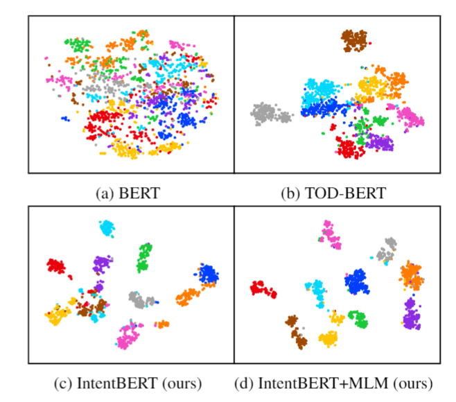
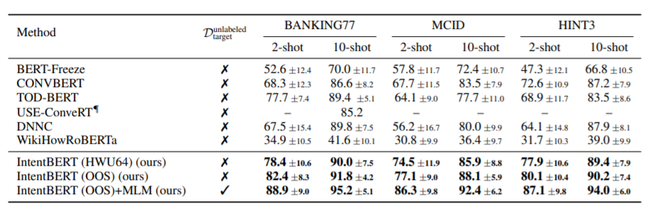

## IntentBERT: Effectiveness of Pre-training for Few-shot Intent Classification

This repository contains the code and pre-trained models for our paper on *EMNLP-findings*: [Effectiveness of Pre-training for Few-shot Intent Classification](https://arxiv.org/abs/2109.05782). We write this readme thanks to this [repo](https://github.com/princeton-nlp/SimCSE).

## Quick Links

  - [Overview](#overview)
  - [Train IntentBERT](#train-intentbert)
    - [Requirements](#requirements)
    - [Evaluation](#evaluation)
    - [Dataset](#dataset)
    - [Before running](#before-running)
    - [Training](#training)
  - [Bugs or Questions?](#bugs-or-questions)
  - [Citation](#citation)

## Overview

* Is it possible to learn transferable task-specific knowledge to generalize across different domains for intent detection?

In this paper, we offer a free lunch solution for few-shot intent detection by pre-training on a large publicly available dataset. Our experiment shows significant improvement over previous pre-trained models on a drastically different target domain, which indicates IntentBERT possesses high generalizability and is a ready-to-use model without further fine-tuning. We also propose a joint pre-training scheme (IntentBERT+MLM) to leverage unlabeled data on target domain.

<p align="center">
    
</p>

<p align="center">
    
</p>

## Train IntentBERT

In the following section, we describe how to train a IntentBERT model by using our code.

### Requirements

Run the following script to install the dependencies,

```bash
pip install -r requirements.txt
```

### Dataset

We provide dataset required for training and evaluation in `data` folder of this repo. Specifically, "oos" & "hwu64" are used for training or validation, "bank77", "mcid" & "hint3" are used as target dataset. In each dataset, there is a `showDataset.py`. You can `cd` into the dataset folder and run it to display the statistics and examples of the dataset.

```bash
python showDataset.py
```

### Before running

Set up the path for data and models in `./utils/commonVar.py` as you wish. For example,

```python
SAVE_PATH = './saved_models'
DATA_PATH = './data'
```

Download the pre-trained IntentBERT model [here](https://1drv.ms/u/s!AsY5oOBeNeY-hCRMnhQQPojqdK8R?e=Ixz4ke), and save under `SAVE_PATH`. The scripts for running experiments are kept in `./scripts`. You can run a script with an argument `debug` for debug mode and `normal` for experiment mode. A log file will save all the outputs into a file under `./log`.

### Evaluation
Code for few-shot evaluation is kept in `eval.py` with a corresponding bash script in `./scripts`.

Run with the default parameters as,
```bash
./scripts/eval.sh normal ${cuda_id}
```

Necessary arguments for the evaluation script are as follows,

* `--dataDir`: Directory for evaluation data
* `--targetDomain`: Target domain name for evaluation
* `--shot`: Shot number for each class
* `--LMName`: Language model name to be evaluated. Could be a language model name in huggingface hub or a directory in `SAVE_PATH`

Change `LMName` to evaluate our provided pre-trained models. We provide four trained models under ./saved_models:
  1. intent-bert-base-uncased
  2. joint-intent-bert-base-uncased-hint3
  3. joint-intent-bert-base-uncased-bank77
  4. joint-intent-bert-base-uncased-mcid

They are corresponding to 'IntentBERT (OOS)', 'IntentBERT (OOS)+MLM'(on hint3), 'IntentBERT (OOS)+MLM'(on bank77) and 'IntentBERT (OOS)+MLM'(on mcid) in the paper.


### Training

Both supervised pre-training and joint pre-training can be run by `transfer.py` with a corresponding script in `./scripts`. Important arguments are shown here,
* `--dataDir`: Directory for training, validation and test data, concat with ","
* `--sourceDomain`: Source domain name for training, concat with ","
* `--valDomain`: Validation domain name, concat with ","
* `--targetDomain`: Target domain name for evaluation, concat with ","
* `--shot`: Shot number for each class
* `--tensorboard`: Enable tensorboard
* `--saveModel`: Enable to save model
* `--saveName`: The name you want to specify for the saved model, or "none" to use the default name
* `--validation`: Enable validation, it is turned off automatically while using joint pre-training
* `--mlm`: Enable mlm, enable this while using joint pre-training
* `--LMName`: Languge model name as an initialization. Could be a language model name in huggingface hub or a directory in `SAVE_PATH`

Note that the results might be different from the reported by 1~3% when training with different seeds.

**Supervised Pre-training**

Turn off `mlm` and turn on `validation`. Change the datasets and domain names for different settings.

**Joint Pre-training**

Turn on `mlm`, `validation` will be turned off automatically. Change the datasets and domain names for different settings.

## Bugs or questions?

If you have any questions related to the code or the paper, feel free to email Haode (`haode.zhang@connect.poly.hk`) and Yuwei (`zhangyuwei.work@gmail.com`). If you encounter any problems when using the code, or want to report a bug, you can open an issue. Please try to specify the problem with details so we can help you better and quicker!

## Citation

Please cite our paper if you use IntentBERT in your work:

```bibtex
@article{zhang2021effectiveness,
   title={Effectiveness of Pre-training for Few-shot Intent Classification},
   author={Haode Zhang and Yuwei Zhang and Li-Ming Zhan and Jiaxin Chen and Guangyuan Shi and Xiao-Ming Wu and Albert Y. S. Lam},
   journal={arXiv preprint arXiv:2109.05782},
   year={2021}
}
```
